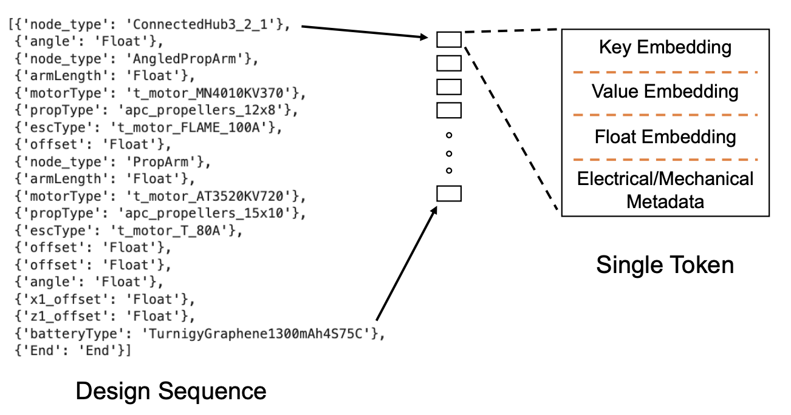

# AircraftVerse


### Accompanying code to the paper: AircraftVerse: A Large-Scale Multimodal Dataset of Aerial Vehicle Designs

We present AircraftVerse, a publicly available aerial vehicle design dataset. AircraftVerse contains 27,714 diverse battery powered aircraft designs that have been evaluated using state-of-the-art physics models that characterize performance metrics such as maximum flight distance and hover-time.

**Paper**: https://arxiv.org/abs/2306.05562

**Dataset**: http://doi.org/10.5281/zenodo.6525446

### Repository Structure

The repository is structured as follows:
* notebooks contains:
    * `DataDemo.ipynb`: This notebook demonstrates how to read the raw data in the dataset.
    * `DataSetPlot.ipynb`: This notebook contains the summary plots of the full data set.
    * `ModelBenchmark.ipynb`: This notebook contains the benchmark experiments for the sequence data. To run this notebook you may need to build the data set according to the encoding of Cobb et al. 2022 (https://arxiv.org/pdf/2211.08138.pdf). This code is provided in `build_transformer_data.py`.
* data contains:
    * 15 illustrative designs taken from AircraftVerse (http://doi.org/10.5281/zenodo.6525446).
    * The corpus dictionary.
    * A example data set build by `build_transformer_data.py`.
* code contains:
    * `build_transformer_data.py`: Apply this file to the folder structure as in the zip file available on http://doi.org/10.5281/zenodo.6525446 to build the dataset as we did in the paper.
    * `ssm.py`: File containing torch models and related helper functions.
    * `util.py`: Some useful plotting functions for the notebooks.
* prob_gen contains:
    * Probabilistic generator for aircraft designs
    * sequence-to-tree parser for designs

## How to set up the dataset

### Download the Data

1. Go to https://zenodo.org/record/6525446 and download the three zip files: `AircraftVerse_1.zip`, `AircraftVerse_2.zip`, and `AircraftVerse_3.zip`.
2. Unzip the folders such that the contents are all in the same folder, e.g. called `./AircraftVerse/data_full`. There should now be 27,714 design folders in `data_full`.

### Viewing a single design

To look at the different files associated with a single design, we have provided a notebook `./AircraftVerse/notebooks/DataDemo.ipynb`.

1. In the first cell of the notebook, set the `path` equal to the relative location of the data, e.g. `../data_full` if you dowloaded the full data into the folder as described above, otherwise use the default designs in `../data`.
2. In the same first cell, set the `design` to the desired design folder, e.g. the default is `design_1`.
3. Then run the remaining cells of the notebook to view the files such as the `'design_tree.json'` and the STL plot.

Note that additional information and comments are included in the notebook for further insights.

### Plot summary statistics of the data

We have provided a notebook `./AircraftVerse/notebooks/DataSetPlot.ipynb` to plot the general statistics of the data set. This corresponds to Figure 4 in the paper.

1. As before, in the first cell of the notebook set the `path` equal to the relative location of the data, e.g. `../data_full`.
2. Ensure that the `corpus` is set to the location of the corpus dictionary. The default location `'../data/corpus_dic'` should work.
3. Running the remaining cells should collect all the summary statistics of the data such as the hover time of each design.

### Training a model

We have provided all the necessary code to both preprocess data and train a transformer model. These instructions will help train such models as well as to serve as a basis to build new ones:

1. Assuming the above steps for downloading the data have been followed, in the terminal change into the `./AircraftVerse/code` directory.
2. In the terminal run the command:
    ```
    python build_transformer_data.py --input ../data_full --save-path ../data_full/transformer_data 
    ```
    This will save the dataset as `../data_full/transformer_data`. Note that this code relies on the relative path of `'../data/corpus_dic'`. The data set is saved on line 279 of `build_transformer_data.py`. The data is saved in the form of a dictionary with the following keys:
    * `'X'`: Tokenization of the sequence data which is a concatenation of the one-hot embedding for the sequence keys and sequence values. For example a single token of a full sequence could be `["node_type": "ConnectedHub4_Sym"]`. The key, `"node_type"`, has its own one-hot encoding, which is concatenated to the one-hot encoding of `"ConnectedHub4_Sym"`. The rest of the single token contains zeros which include floats and corpus metadata when the token key requires it. This concatenation is illustrated by this Figure:
    
    * `'X_norm'`: This is the same as `'X'`, except the additional component metadata is normalized by summary statistics taken from the corpus data.
    * `'y'`: List of masses (kg).
    * `'airworthy'`: List of binary labels. 1 for hover, 0 for cannot hover.
    * `'hover_time'`: List of hover times (s).
    * `'max_speed'`: List of maximum speeds (m/s).
    * `'max_distance'`: List of maximum distances (m).
    * `'interference_list'`: List of number of interferences.
    * `'encoding_dict_keys'`: Encoding dictionary for sequence keys. E.g. the key `"node_type"` for this dictionary will provide the one hot encoding.
    * `'encoding_dict_values'`: Encoding dictionary for sequence values. E.g. the key `"ConnectedHub4_Sym"` for this dictionary will provide the one hot encoding.
    * `'norm_dict'`: The summary statistics, such as means and standard deviations, for the component corpus used to get `X_norm`.
    * `'path'`: The input path. E.g. `'../data_full'`.
    * `'folders'`: List of the design folders.
3. To then train a model on the preprocessed data, open `AircraftVerse/notebooks/ModelBenchmark.ipynb`. Set the data_path in the second cell to `'../data_full/transformer_data'`. 
4. In the same cell, select the specification of interest. The default should be `'airworthy'`, which will turn the problem into a binary classification problem. Selection of other specifications such as `'hover'` turn the problem into a regression problem.
5. In cell 5 set the `mode` variable to either `'transformer'` or `'lstm'`.
6. Running the rest of the notebook will train the model according to the loss that was determined by selecting the specification.

## Acknowledgements

This project was supported by DARPA under the Symbiotic
Design for Cyber-Physical Systems (SDCPS) with contract
FA8750-20-C-0002.
The views, opinions and/or findings expressed
are those of the author and should not be interpreted as
representing the official views or policies of the Department
of Defense or the U.S. Government.
