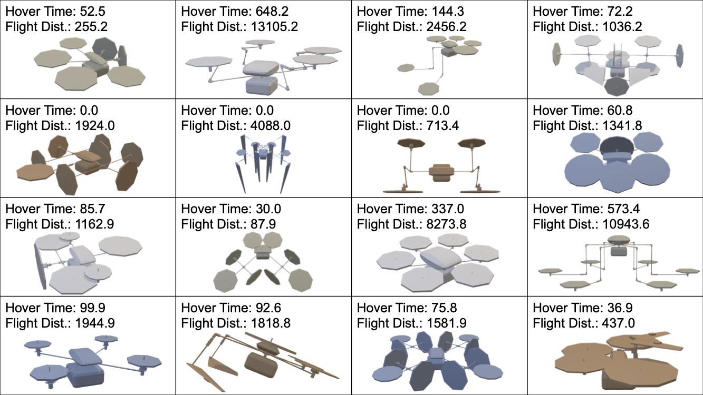

# AircraftVerse

### Accompanying code to the paper: AircraftVerse: A Large-Scale Multimodal Dataset of Aerial Vehicle Designs

We present AircraftVerse, a publicly available aerial vehicle design dataset. AircraftVerse contains 28,080 diverse battery powered aircraft designs that have been evaluated using state-of-the-art physics models that characterize performance metrics such as maximum flight distance and hover-time.

**Paper**: https://arxiv.org/abs/2306.05562

**Dataset**: http://doi.org/10.5281/zenodo.6525446

### Repository Structure

The repository is structured as follows:
* notebooks contains:
    * `DataDemo.ipynb`: This notebook demonstrates how to read the raw data in the dataset. 
    * `DataSetPlot.ipynb`: This notebook contains the summary plots of the full data set.
    * `ModelBenchmark.ipynb`: This notebook contains the benchmark experiments for the sequence data. To run this notebook you may need to build the data set according to the encoding of Cobb et al. 2022 (https://arxiv.org/pdf/2211.08138.pdf). This code is provided in `build_transformer_data.py`.
* data contains:
    * 15 illustrative designs taken from AircraftVerse (http://doi.org/10.5281/zenodo.6525446).
    * The corpus dictionary.
    * A example data set build by `build_transformer_data.py`.
* code contains:
    * `build_transformer_data.py`: Apply this file to the folder structure as in the zip file available on http://doi.org/10.5281/zenodo.6525446 to build the dataset as we did in the paper.
    * `ssm.py`: File containing torch models and related helper functions.
    * `util.py`: Some useful plotting functions for the notebooks.

## Acknowledgements

This project was supported by DARPA under the Symbiotic
Design for Cyber-Physical Systems (SDCPS) with contract 
FA8750-20-C-0002. 
The views, opinions and/or findings expressed
are those of the author and should not be interpreted as
representing the official views or policies of the Department
of Defense or the U.S. Government.
